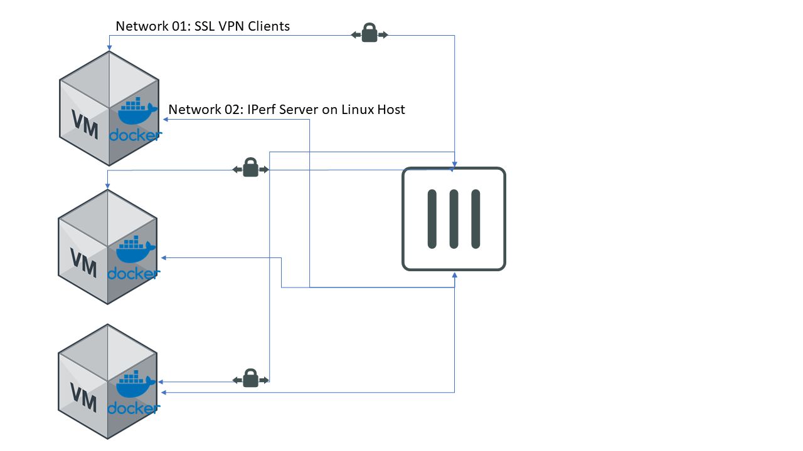

# FC SSL PerfTester

This tool was developed to generate multiple SSL VPN Connections to a FortiGate and pass iperf traffic to do performance testing on the Fortigate.

This project is based on HybirdCorp (https://github.com/HybirdCorp/docker-forticlient) Docker Container that creates a Linux container with FortiClient and peforms 1 SSL VPN connection.

## How it works
The container uses the forticlientsslvpn_cli linux binary to manage ppp interface, all of the container traffic is routed through the VPN.

The perftest_launch.sh script will execute iperf Server on the Host and the container which opens the SSL VPN then run an iperf client on the same port as the iperf server for this thread.

## Automation Scripts
perftest_launch.sh will launch one or multiple instances for the docker container and the iperf server on different ports, screen is used to background the commands, you can check launched process with screen, example
```bash
#Query opened Screens
screen -ls
There are screens on:
        5716.5202.ssl   (06/08/2020 01:44:44 PM)        (Detached)
        5710.5202.iperf (06/08/2020 01:44:44 PM)        (Detached)

#Attach to a Screen session
screen -r ID

#Detach from Screen session
CTRL+A CTRL+D

```

perftest_killscreens.sh will send CTRL+C command to every screen session killing all sessions.

## Modify the Test
### Update Variables
Update perftest_launch.sh with the connection information set on the variables at the beginning
```bash
#Change to the lowest port to use by iperf, each new container will increment port by 1
basePort=5201 
#VPN Server IP / Username / Password
fgtVPNIP=10.20.28.2:10443
fgtVPNUser=vpnuser
fgtVPNPass=VPNpassw0rd
#iperf Server IP
iperfSIP=10.20.28.228
```
### Change Traffic Generation Parameters (iperf3)
To change the iperf parameters modify perftest_launch.sh file under iperf Client section and update with your parameters.

## Installation
To run the script you will need a Linux VM (Host) with the following dependencies
* Docker
* bash
* iperf
* 2 Network Interfaces

A common implementation will look like this



## Performance
Performance depends on the host VM, as a reference I've tested 180 SSL VPN connections with a Linux Host with 4 vCPUs and 8 GB of RAM, the VM reached memory at 184 containers.

To increase the test you can increase resources on the Host VM or Clone the Host and run on multiple hosts.

## Execute
```bash
# Build Container
docker build --tag fc_perf_tst:0.1 .

# Run multiple containers with the Script
./perftest_launch.sh 150

# Kill all Sessions
./perftest_killscreens.sh

# Run Docker Manually
docker run -it --rm   --privileged   --net fortinet  -e VPNADDR=10.20.28.2:10443   -e VPNUSER=vpnuser   -e VPNPASS=VPNpassw0rd   -e VPNTIMEOUT=15 --name vpnTest fc_perf_tst:0.1

# Run iPerf 
## Server On Host
iperf -s -p 5201
## Client On Docker Container
docker exec -ti vpnTest iperf3 -t 1200 -b 5m -c 10.20.28.228 -p 5201

```

## Precompiled binaries
Thanks to [https://hadler.me](https://hadler.me/linux/forticlient-sslvpn-deb-packages/) for hosting up to date precompiled binaries which are used in this Dockerfile.